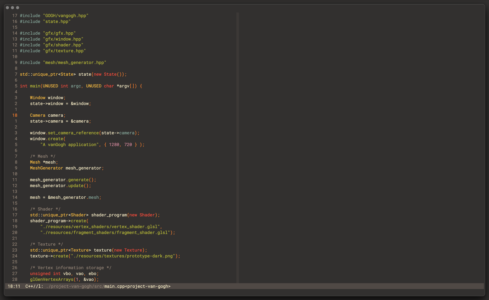

# The "GruverBoxer" theme

Is [emacs-theme-gruvbox](https://github.com/greduan/emacs-theme-gruvbox) and
[suscolors](https://github.com/TheSuspiciousWombat/suscolors-emacs) not enough
gruvbox for you? Then I present you an even more gruv'ier and box'ier gruvbox
theme for your favorite editor. Heavely inspired by the creator itself 
[morhetz/gruvbox](https://github.com/morhetz/gruvbox).

For the unkowning people, Gruvbox is a retro groove color scheme and this 
repository is a port from the [original](https://github.com/morhetz/gruvbox).
But with some tweaks based from this [video](https://www.youtube.com/watch?v=u8wrPlpeO5A) 
which the youtuber [jdah](https://www.youtube.com/c/jdhvideo) created. 

> **Note**: This isn't the original gruvbox theme, but is inspired by it. Also
> it is still very much a work in progress.

## License
Dear Americans I got some freedom for you because this entire repo is MIT
licensed, this includes:

- images/ 
- gruverboxer-theme.el

## Acknowledgments

* [morhetz/gruvbox](https://github.com/morhetz/gruvbox)
* [jdah](https://www.youtube.com/watch?v=u8wrPlpeO5A)
* [emacs gruvbox](https://github.com/greduan/emacs-theme-gruvbox)
